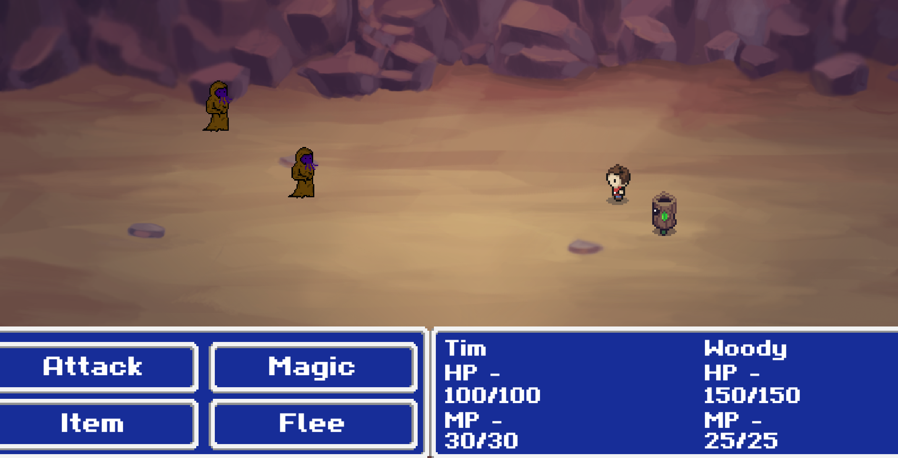
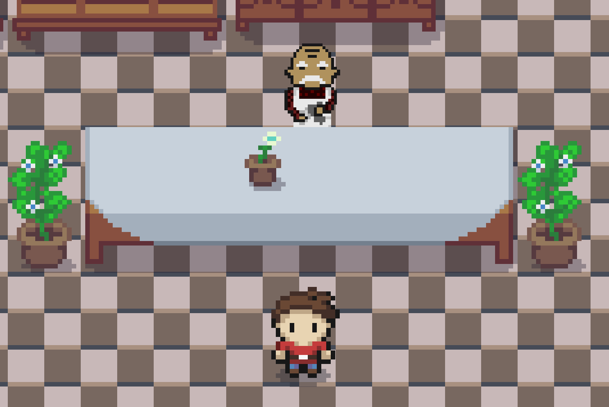
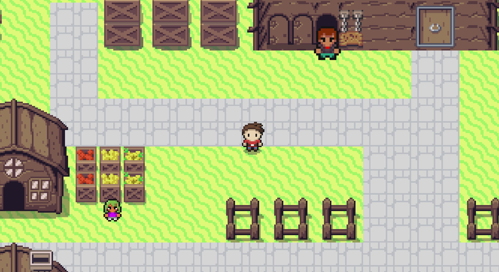

# TurnBasedRpg
* Practice RPG for getting used to different kind of 2D styles.

## For full game:
* Check out the versioning
* Download the zip
* Extract the folder
* Open the 2DRpg.exe
* Enjoy!

## Versioning:
### Newest version
* [Version 1.0.0]()

# Built using
* Visual Studio Code
* Unity

# Screenshots

